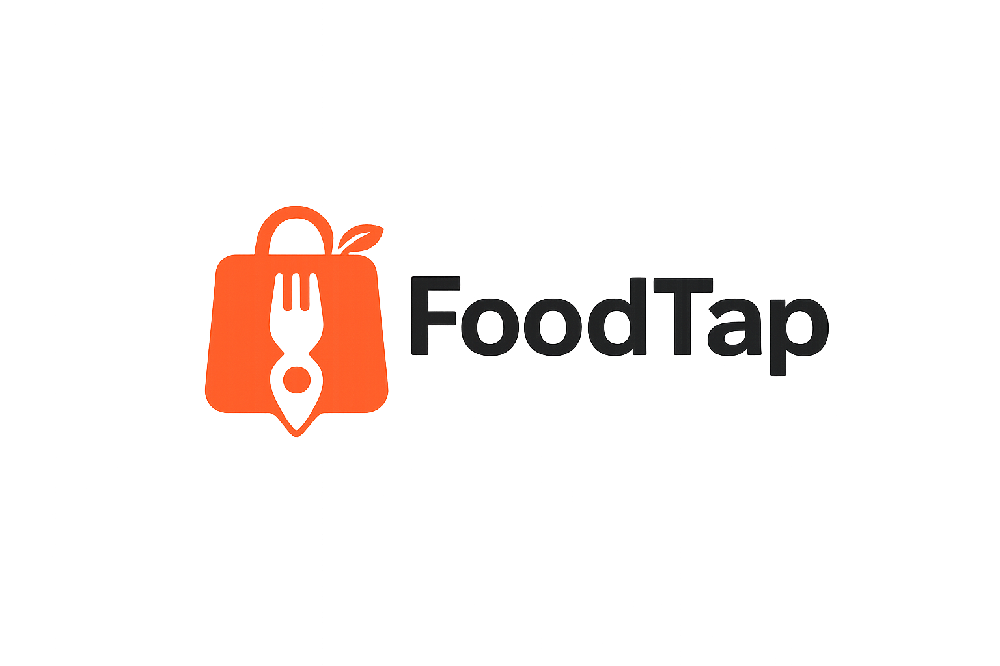

# 🍽️ FoodTap

<div align="center">



### Marketplace móvil para la compra y venta de alimentos locales.

Desarrollado con **Flutter** y **Firebase**.

</div>

---

# 📖 Descripción

FoodTap es una aplicación móvil que permite a cualquier usuario comprar y vender alimentos de forma sencilla y segura.

A diferencia de otros marketplaces, cada publicación pasa por un proceso de revisión realizado por un administrador antes de hacerse visible para los demás usuarios, garantizando que el contenido publicado sea apropiado.

---

# 🎯 Objetivo

Desarrollar una aplicación móvil intuitiva que facilite la compra y venta de alimentos locales, ofreciendo una experiencia rápida, segura y organizada tanto para compradores como para vendedores.

---

# ✨ Funcionalidades

## Usuarios

- Registro de usuarios
- Inicio de sesión
- Recuperación de contraseña
- Perfil de usuario
- Cerrar sesión

## Productos

- Publicar productos
- Una imagen por producto
- Categorías predefinidas
- Estados de publicación:
  - Pendiente
  - Aprobado
  - Rechazado
  - Suspendido
- Suspender y reactivar publicaciones

## Compras

- Buscar productos
- Ver detalle del producto
- Contactar al vendedor mediante chat
- Realizar pedidos
- Consultar historial de pedidos

## Administrador

- Dashboard
- Revisar publicaciones pendientes
- Aprobar productos
- Rechazar productos indicando el motivo
- Consultar publicaciones aprobadas
- Consultar publicaciones rechazadas
- Consultar publicaciones suspendidas

---

# 🛠 Tecnologías

| Tecnología | Uso |
|------------|-----|
| Flutter | Desarrollo móvil |
| Dart | Lenguaje |
| Firebase Authentication | Inicio de sesión |
| Cloud Firestore | Base de datos |
| Firebase Storage | Almacenamiento de imágenes |
| Provider | Gestión de estado |
| GoRouter | Navegación |

---

# 🎨 Diseño

El diseño de la aplicación está inspirado en plataformas modernas como:

- DiDi Food
- Rappi
- Uber Eats

Principios del diseño:

- Interfaz limpia
- Colores cálidos
- Navegación sencilla
- Componentes reutilizables

---

# 📂 Arquitectura

```
lib/
│
├── core/
├── features/
├── models/
├── assets/
└── main.dart
```

---

# 🌳 Flujo de trabajo Git

Ramas del proyecto:

```
main
│
└── develop
```

Todo el desarrollo se realizará sobre la rama **develop**.

La rama **main** únicamente contendrá versiones estables del proyecto.

---

# 👥 Equipo de desarrollo

- Uriel Rizxxx
- Integrante 2
- Integrante 3
- Integrante 4

---

# 📅 Cronograma

- Semana 1 → Arquitectura y configuración
- Semana 2 → Autenticación
- Semana 3 → Catálogo de productos
- Semana 4 → Publicaciones y pedidos
- Semana 5 → Panel administrador y chat
- Semana 6 → Pruebas, documentación y entrega

---

# 📌 Estado del proyecto

🟡 En desarrollo

Versión actual:

```
v0.1.0
```

---

# 📄 Licencia

Proyecto académico desarrollado para la Universidad Politécnica de Tapachula.
